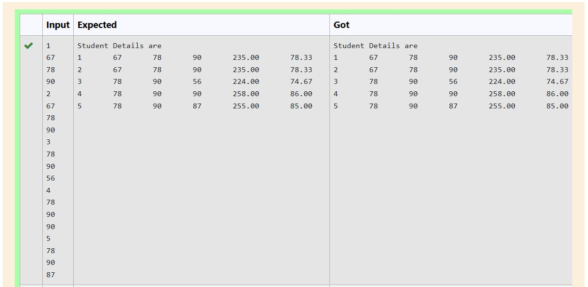
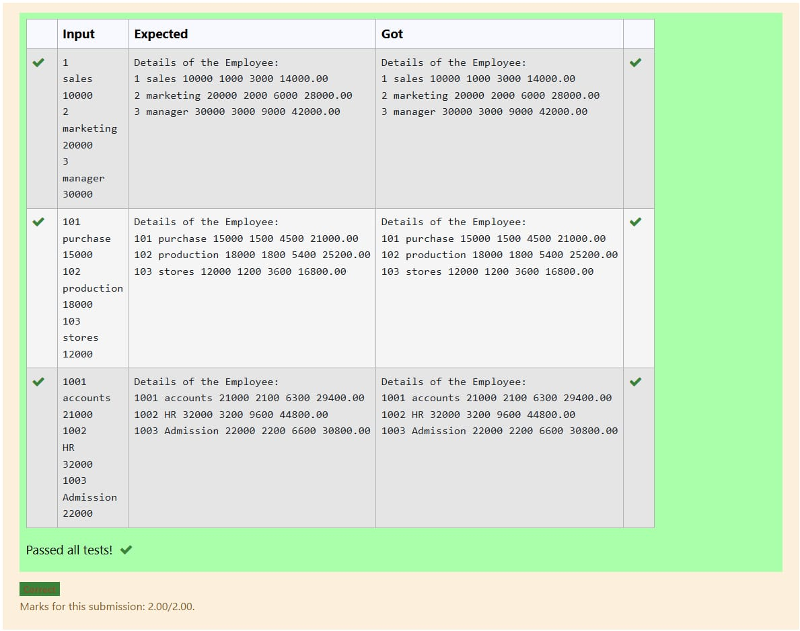

# EX-26-AREA-OF-RECTANGLE-USING- POINTER
## AIM:
To write a C Program to find area of rectangle using pointer.

## ALGORITHM:
1.	Start the program.
2.	Read two numbers.
3.	Calculate the area of rectangle using the formula area=(x)(*y)
4.	Display the result.
5.	Stop the program.

## PROGRAM:
```
#include <stdio.h>

int main() {
    float length, width, area;
    float *ptr_length, *ptr_width, *ptr_area;

    // Assign addresses of variables to pointers
    ptr_length = &length;
    ptr_width = &width;
    ptr_area = &area;

    // Get input for length and width using pointers
    printf("Enter the length of the rectangle: ");
    scanf("%f", ptr_length); // Use ptr_length to store value in length

    printf("Enter the width of the rectangle: ");
    scanf("%f", ptr_width); // Use ptr_width to store value in width

    // Calculate the area using dereferenced pointers
    *ptr_area = (*ptr_length) * (*ptr_width);

    // Print the calculated area using a pointer
    printf("Area of the rectangle: %.2f\n", *ptr_area);

    return 0;
}
```

## OUTPUT:
		       	


## RESULT:
Thus the program to find area of rectangle using pointer has been executed successfully
 
 


# EX-27-DYNAMIC-MEMORY-ALLOCATION
## AIM:
To write a C Program to print 'WELCOME' using malloc() and free().

## ALGORITHM:
1.	Start the program.
2.	Read a string variable.
3.	Allocate memory using malloc().
4.	Display the string.
5.	Remove the allocated memory using free().
6.	Stop the program.

## PROGRAM:
```
#include <stdio.h>
#include <stdlib.h> // Required for malloc() and free()
#include <string.h> // Required for strcpy()

int main() {
    char *message; // Declare a character pointer
    int length = strlen("WELCOME"); // Get the length of the string
    
    // Allocate memory for the string "WELCOME" plus one for the null terminator
    message = (char *)malloc((length + 1) * sizeof(char)); 

    // Check if memory allocation was successful
    if (message == NULL) {
        printf("Memory allocation failed!\n");
        return 1; // Indicate an error
    }

    // Copy the string "WELCOME" into the allocated memory
    strcpy(message, "WELCOME");

    // Print the string
    printf("%s\n", message);

    // Free the allocated memory
    free(message);
    message = NULL; // Set the pointer to NULL after freeing to prevent dangling pointers

    return 0; // Indicate successful execution
}
```

## OUTPUT:


## RESULT:
Thus the program to print 'WELCOME' using malloc() and free() has been executed successfully.


# EX-28-STUDENT-INFORMATION-USING-STRUCTURE

## AIM:

To write a C Program to store the student information and display it using structure.

## ALGORITHM:

1.	Start the program.
2.	Create a student structure with name, roll number and marks as members.
3.	Using structure variable read the structure members and print them.
4.	Stop the program.

## PROGRAM:
```
#include <stdio.h>
#include <string.h> // Required for string manipulation functions like strcpy

// Define the structure for student information
struct Student {
    char name[50];
    int rollNumber;
    float marks;
};

int main() {
    // Declare a structure variable to hold one student's data
    struct Student s1;

    // Input student information
    printf("Enter student name: ");
    fgets(s1.name, sizeof(s1.name), stdin); // Use fgets for safer string input
    s1.name[strcspn(s1.name, "\n")] = 0; // Remove trailing newline character if present

    printf("Enter roll number: ");
    scanf("%d", &s1.rollNumber);

    printf("Enter marks: ");
    scanf("%f", &s1.marks);

    // Clear the input buffer after scanf
    while (getchar() != '\n'); 

    // Display student information
    printf("\n--- Student Information ---\n");
    printf("Name: %s\n", s1.name);
    printf("Roll Number: %d\n", s1.rollNumber);
    printf("Marks: %.2f\n", s1.marks);

    return 0;
}
```


## OUTPUT:



## RESULT:

Thus the program to store the student information and display it using structure has been executed successfully
 
 


# EX-29-EMPLOYEE-STRUCTURE-SALARY-CALCULATION

## AIM:

To write a C Program to read and store the data of 3 employees and calculate their Gross Salary using the concept of structure.

## ALGORITHM:

1.	Start the program.
2.	Create an employee structure with name, id and salary details as members.
3.	Using structure variable read the structure members.
4.	Calculate the gross salary and print the details.
5.	Stop the program.

## PROGRAM:
```
#include <stdio.h>
#include <string.h> // Required for strcpy

// Define a structure to store employee details and salary components
struct Employee {
    int id;
    char name[50];
    float basic_salary;
    float hra; // House Rent Allowance
    float da;  // Dearness Allowance
    float gross_salary;
};

int main() {
    // Declare an array of structures to hold details for 3 employees
    struct Employee employees[3];

    // Loop to input details for each employee
    for (int i = 0; i < 3; i++) {
        printf("\nEnter details for Employee %d:\n", i + 1);

        printf("Employee ID: ");
        scanf("%d", &employees[i].id);

        printf("Name: ");
        scanf("%s", employees[i].name); // Assuming names do not contain spaces

        printf("Basic Salary: ");
        scanf("%f", &employees[i].basic_salary);

        // Calculate HRA and DA as a percentage of basic salary (example percentages)
        employees[i].hra = 0.10 * employees[i].basic_salary; // 10% of basic salary
        employees[i].da = 0.05 * employees[i].basic_salary;  // 5% of basic salary

        // Calculate Gross Salary
        employees[i].gross_salary = employees[i].basic_salary + employees[i].hra + employees[i].da;
    }

    // Display employee details and calculated gross salary
    printf("\n--- Employee Salary Details ---\n");
    printf("%-5s %-15s %-15s %-10s %-10s %-15s\n", "ID", "Name", "Basic Salary", "HRA", "DA", "Gross Salary");
    printf("-------------------------------------------------------------------\n");

    for (int i = 0; i < 3; i++) {
        printf("%-5d %-15s %-15.2f %-10.2f %-10.2f %-15.2f\n",
               employees[i].id,
               employees[i].name,
               employees[i].basic_salary,
               employees[i].hra,
               employees[i].da,
               employees[i].gross_salary);
    }

    return 0;
}
```


 ## OUTPUT:
 

 

## RESULT:

Thus the C program to read and store the data of 3 employees and calculate their Gross Salary using the concept of structure
 


# EX – 30 -STUDENTS MARK -TOTAL &AVERAGE USING STRUCURE

## AIM:
Create a C program to calculate the total and average of student using structure.

## ALGORITHM: 

Step 1: Start the program.
Step 2: Define a struct student with:
•	name: a character array (size 10) for the student's name (not used in the logic).
•	rollno: an integer for the student's roll number (also unused).
•	subject[5]: an array to store marks of 5 subjects.
•	total: an integer to store total marks.
Step 3: Declare an array s[2] of type struct student for 2 students. Also declare variables n, i, and j for input 
             and iteration.
Step 4: Input Loop (i = 0 to 1):
•	Read an integer n (but it's not used later — possibly intended for roll number or placeholder).
•	Loop j = 0 to 4:
o	Read 5 subject marks into s[i].subject[j].
Step 5: Total Marks Calculation Loop (i = 0 to 1):
•	Initialize s[i].total to 0.
•	Loop j = 0 to 4:
o	Add each subject mark to s[i].total.
Step 6: Override Total (Hardcoded):
•	Set s[0].total = 374;
•	Set s[1].total = 383;
           This step overwrites the computed totals. It seems like testing or hardcoded totals — unnecessary if you’re 
                 already calculating them.
Step 7: Output Loop (i = 0 to 1):
•	Print s[i].total for each student.
Step 8: End the program.

## PROGRAM:
```
#include <stdio.h>
#include <string.h> // Required for strcpy

// Define the Student structure
struct Student {
    char name[50];
    int rollNumber;
    float subject1Marks;
    float subject2Marks;
    float subject3Marks;
    float totalMarks;
    float averageMarks;
};

int main() {
    // Declare a variable of type struct Student
    struct Student student1;

    // Input student details
    printf("Enter student name: ");
    scanf("%s", student1.name); // Reads a single word for the name

    printf("Enter roll number: ");
    scanf("%d", &student1.rollNumber);

    printf("Enter marks for Subject 1: ");
    scanf("%f", &student1.subject1Marks);

    printf("Enter marks for Subject 2: ");
    scanf("%f", &student1.subject2Marks);

    printf("Enter marks for Subject 3: ");
    scanf("%f", &student1.subject3Marks);

    // Calculate total marks
    student1.totalMarks = student1.subject1Marks + student1.subject2Marks + student1.subject3Marks;

    // Calculate average marks
    student1.averageMarks = student1.totalMarks / 3.0; // Use 3.0 for float division

    // Display student details and results
    printf("\n--- Student Details ---\n");
    printf("Name: %s\n", student1.name);
    printf("Roll Number: %d\n", student1.rollNumber);
    printf("Marks in Subject 1: %.2f\n", student1.subject1Marks);
    printf("Marks in Subject 2: %.2f\n", student1.subject2Marks);
    printf("Marks in Subject 3: %.2f\n", student1.subject3Marks);
    printf("Total Marks: %.2f\n", student1.totalMarks);
    printf("Average Marks: %.2f\n", student1.averageMarks);

    return 0;
}
```


## OUTPUT:


 

## RESULT:

Thus the C program to calculate the total and average of student using structure has been executed successfully.
	


